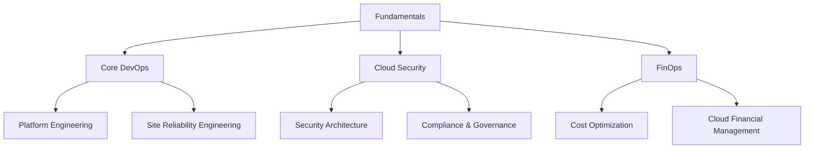

# 🚀 DevOps, FinOps & Cloud Security Learning Roadmap 2025

> **A comprehensive, hands-on learning path for DevOps, FinOps, and Cloud Security professionals. Build real-world skills through practical projects and curated free resources.**

## 📋 Table of Contents

- [🎯 Introduction](#-introduction)
- [🛤️ Learning Paths](#️-learning-paths)
- [📚 Prerequisites & Fundamentals](#-prerequisites--fundamentals)
- [🔧 Core Skills](#-core-skills)
- [🏗️ Hands-On Projects](#️-hands-on-projects)
- [📖 Learning Resources](#-learning-resources)
- [🏆 Certifications](#-certifications)
- [🤝 Soft Skills & Culture](#-soft-skills--culture)
- [⏱️ Learning Timelines](#️-learning-timelines)
- [🌍 Regional Considerations](#-regional-considerations)
- [🤝 Contributing](#-contributing)
- [📰 Stay Updated](#-stay-updated)
- [📚 Appendices](#-appendices)

---

## 🎯 Introduction

### Who This Roadmap Is For

- **Beginners**: New to DevOps/Cloud with basic IT knowledge
- **Intermediate**: Some experience, looking to specialize or advance
- **Specialists**: Experienced professionals seeking expertise in specific domains

### How to Use This Roadmap

1. **Choose Your Path**: Start with fundamentals, then branch into specializations
2. **Track Progress**: Use the checklists and project milestones
3. **Learn by Doing**: Complete hands-on projects for each skill level
4. **Build Portfolio**: Document your learning journey and projects

### Learning Philosophy

- **Hands-on First**: Every concept backed by practical exercises
- **Free Resources**: Curated high-quality free materials
- **Real Projects**: Build actual systems, not just tutorials
- **Community Driven**: Learn from and contribute to the community

## 🛤️ Learning Paths

### 🎯 Choose Your Specialization

### 📊 Skill Level Progression

| Level | Duration | Focus | Projects |
|-------|----------|-------|----------|
| **Beginner** | 2-3 months | Fundamentals, Basic Tools | 3-5 small projects |
| **Intermediate** | 3-4 months | Specialization, Advanced Tools | 5-8 medium projects |
| **Advanced** | 4-6 months | Architecture, Leadership | 3-5 complex projects |

---

## 📚 Prerequisites & Fundamentals

### ✅ Essential Knowledge Checklist

| Topic | Importance | Time Investment | Free Resources |
|-------|------------|-----------------|----------------|
| **Linux Fundamentals** | ⭐⭐⭐⭐⭐ | 2-3 weeks | [Linux Journey](https://linuxjourney.com/), [KodeKloud Linux Labs](https://kodekloud.com/courses/linux-basics-for-beginners/) |
| **Networking Basics** | ⭐⭐⭐⭐⭐ | 2-3 weeks | [Computer Networks Course](https://www.youtube.com/playlist?list=PLowKtXNTBypH19whXTVoG3oKSuOcw_XeW) |
| **Git & Version Control** | ⭐⭐⭐⭐⭐ | 1-2 weeks | [Git Tutorial](https://www.atlassian.com/git/tutorials), [GitHub Learning Lab](https://lab.github.com/) |
| **Basic Programming** | ⭐⭐⭐⭐ | 3-4 weeks | [Python for Everybody](https://www.py4e.com/), [Bash Scripting Guide](https://tldp.org/LDP/abs/html/) |
| **Cloud Concepts** | ⭐⭐⭐⭐ | 1-2 weeks | [Cloud Computing Basics](https://aws.amazon.com/what-is-cloud-computing/) |

### 🎯 Learning Objectives

- [ ] Navigate Linux file system and execute commands
- [ ] Understand TCP/IP, HTTP/HTTPS, DNS fundamentals
- [ ] Create and manage Git repositories
- [ ] Write basic scripts in Python/Bash
- [ ] Explain cloud computing models (IaaS, PaaS, SaaS)

## 🔧 Core Skills

### 🐍 Programming & Scripting

#### Beginner Level
- **Python Basics**: Variables, loops, functions, file handling
- **Bash Scripting**: Automation, system administration
- **JSON/YAML**: Configuration file handling

#### Intermediate Level
- **API Integration**: REST APIs, webhooks
- **Error Handling**: Logging, debugging
- **Testing**: Unit tests, integration tests

#### Advanced Level
- **Advanced Python**: OOP, async programming, libraries
- **Go/Rust**: Systems programming, performance
- **Scripting Best Practices**: Code review, documentation

**🎯 Hands-On Project**: Build a monitoring script that collects system metrics and sends alerts

**📚 Free Resources:**
- [Python for DevOps](https://www.python.org/devops/)
- [Bash Scripting Tutorial](https://ryanstutorials.net/bash-scripting-tutorial/)
- [Learn Go with Tests](https://quii.gitbook.io/learn-go-with-tests/)

### 🐧 Linux & System Administration

#### Beginner Level
- **File System**: Navigation, permissions, ownership
- **Process Management**: ps, top, systemctl
- **Package Management**: apt, yum, snap

#### Intermediate Level
- **System Monitoring**: htop, iotop, netstat
- **Log Management**: journald, logrotate
- **User Management**: groups, sudo, SSH

#### Advanced Level
- **Kernel Tuning**: sysctl, performance optimization
- **Security Hardening**: SELinux, AppArmor
- **Troubleshooting**: strace, gdb, system analysis

**🎯 Hands-On Project**: Set up a secure web server with SSL, monitoring, and automated backups

**📚 Free Resources:**
- [Linux Journey](https://linuxjourney.com/)
- [KodeKloud Linux Labs](https://kodekloud.com/courses/linux-basics-for-beginners/)
- [Linux Academy Free Courses](https://linuxacademy.com/)

### 🐳 Containerization & Orchestration

#### Beginner Level
- **Docker Basics**: Images, containers, Dockerfile
- **Docker Compose**: Multi-container applications
- **Container Registry**: Push/pull images

#### Intermediate Level
- **Kubernetes Fundamentals**: Pods, services, deployments
- **Helm**: Package management
- **Container Security**: Best practices, scanning

#### Advanced Level
- **Kubernetes Advanced**: Operators, CRDs, RBAC
- **Service Mesh**: Istio, Linkerd
- **Multi-cluster Management**: Federation, GitOps

**🎯 Hands-On Project**: Deploy a microservices application with monitoring and CI/CD

**📚 Free Resources:**
- [Docker Official Tutorial](https://docs.docker.com/get-started/)
- [Kubernetes Basics](https://kubernetes.io/docs/tutorials/kubernetes-basics/)
- [Play with Kubernetes](https://labs.play-with-k8s.com/)

### ☁️ Cloud Platforms

#### Choose Your Primary Cloud Provider

| Provider | Free Tier | Learning Path | Certifications |
|----------|-----------|---------------|----------------|
| **AWS** | 12 months | [AWS Training](https://aws.amazon.com/training/) | [AWS Certifications](https://aws.amazon.com/certification/) |
| **Azure** | $200 credit | [Microsoft Learn](https://docs.microsoft.com/en-us/learn/) | [Azure Certifications](https://docs.microsoft.com/en-us/learn/certifications/) |
| **GCP** | $300 credit | [Google Cloud Training](https://cloud.google.com/training) | [GCP Certifications](https://cloud.google.com/certification) |

#### Core Services to Master
- **Compute**: EC2/VM instances, serverless functions
- **Storage**: S3/Blob storage, databases
- **Networking**: VPC, load balancers, CDN
- **Security**: IAM, encryption, compliance
- **Monitoring**: CloudWatch/Log Analytics/Stackdriver

**🎯 Hands-On Project**: Build a highly available web application with auto-scaling and disaster recovery

### 🏗️ Infrastructure as Code (IaC)

#### Beginner Level
- **Terraform Basics**: Resources, providers, state
- **CloudFormation**: Templates, stacks
- **ARM Templates**: Azure resource management

#### Intermediate Level
- **Terraform Advanced**: Modules, workspaces, remote state
- **Pulumi**: Programming language approach
- **Ansible**: Configuration management

#### Advanced Level
- **Multi-cloud IaC**: Cross-platform deployments
- **Policy as Code**: OPA, Sentinel
- **GitOps**: ArgoCD, Flux

**🎯 Hands-On Project**: Create a complete infrastructure stack with monitoring, security, and backup

**📚 Free Resources:**
- [Terraform Learn](https://learn.hashicorp.com/terraform)
- [Ansible Documentation](https://docs.ansible.com/)
- [Pulumi Tutorials](https://www.pulumi.com/docs/get-started/)

### 🔄 CI/CD & Automation

#### Beginner Level
- **GitHub Actions**: Workflows, secrets, environments
- **Jenkins**: Pipelines, plugins, automation
- **GitLab CI**: YAML pipelines, runners

#### Intermediate Level
- **Pipeline Design**: Multi-stage, parallel execution
- **Testing Integration**: Unit, integration, E2E tests
- **Deployment Strategies**: Blue-green, canary, rolling

#### Advanced Level
- **Advanced CI/CD**: Feature flags, A/B testing
- **Security Integration**: SAST, DAST, dependency scanning
- **Performance Testing**: Load testing, monitoring

**🎯 Hands-On Project**: Build a complete CI/CD pipeline with automated testing, security scanning, and deployment

**📚 Free Resources:**
- [GitHub Actions Documentation](https://docs.github.com/en/actions)
- [Jenkins Tutorial](https://www.jenkins.io/doc/tutorials/)
- [GitLab CI/CD](https://docs.gitlab.com/ee/ci/)

### 📊 Monitoring & Observability

#### Beginner Level
- **Prometheus**: Metrics collection, querying
- **Grafana**: Dashboards, visualization
- **ELK Stack**: Log aggregation, analysis

#### Intermediate Level
- **Distributed Tracing**: Jaeger, Zipkin
- **APM**: Application performance monitoring
- **Alerting**: AlertManager, PagerDuty integration

#### Advanced Level
- **SLO/SLI**: Service level objectives
- **Chaos Engineering**: Fault injection, resilience testing
- **Observability**: OpenTelemetry, custom metrics

**🎯 Hands-On Project**: Implement comprehensive monitoring for a microservices architecture

**📚 Free Resources:**
- [Prometheus Documentation](https://prometheus.io/docs/)
- [Grafana Tutorials](https://grafana.com/tutorials/)
- [ELK Stack Guide](https://www.elastic.co/guide/)

### 🔒 Security & Compliance (DevSecOps)

#### Beginner Level
- **Security Fundamentals**: OWASP Top 10, threat modeling
- **IAM**: Identity and access management
- **Secrets Management**: Vault, AWS Secrets Manager

#### Intermediate Level
- **Container Security**: Image scanning, runtime protection
- **Network Security**: Firewalls, VPNs, WAF
- **Compliance**: SOC 2, PCI DSS, GDPR

#### Advanced Level
- **Security Architecture**: Zero trust, defense in depth
- **Incident Response**: Forensics, recovery procedures
- **Security Automation**: SAST/DAST integration

**🎯 Hands-On Project**: Implement a secure CI/CD pipeline with automated security testing

**📚 Free Resources:**
- [OWASP DevSecOps](https://owasp.org/www-project-devsecops/)
- [Cloud Security Alliance](https://cloudsecurityalliance.org/)
- [NIST Cybersecurity Framework](https://www.nist.gov/cyberframework)

### 💰 FinOps & Cost Management

#### Beginner Level
- **Cloud Billing**: Understanding costs, pricing models
- **Tagging Strategy**: Resource organization, cost allocation
- **Basic Optimization**: Right-sizing, reserved instances

#### Intermediate Level
- **Cost Monitoring**: Budgets, alerts, reporting
- **Advanced Optimization**: Spot instances, auto-scaling
- **Cost Governance**: Policies, approval workflows

#### Advanced Level
- **FinOps Framework**: Culture, processes, tools
- **Multi-cloud Cost Management**: Cross-platform optimization
- **Cost Prediction**: Forecasting, capacity planning

**🎯 Hands-On Project**: Optimize cloud costs for a multi-environment setup with detailed reporting

**📚 Free Resources:**
- [FinOps Foundation](https://www.finops.org/)
- [AWS Cost Optimization](https://aws.amazon.com/pricing/cost-optimization/)
- [Cloud Financial Management](https://cloud.google.com/cost-management)

## 🏗️ Hands-On Projects

### 🎯 Project-Based Learning Approach

Each project builds upon previous skills and introduces new concepts. Complete projects in order for maximum learning benefit.

### 📊 Project Difficulty Matrix

| Project | Duration | Skills | Difficulty | Cloud Credits Needed |
|---------|----------|--------|------------|---------------------|
| **Beginner** | 1-2 weeks | Linux, Git, Basic Scripting | ⭐⭐ | $0-10 |
| **Intermediate** | 2-4 weeks | Cloud, Containers, CI/CD | ⭐⭐⭐ | $10-50 |
| **Advanced** | 4-8 weeks | Architecture, Security, FinOps | ⭐⭐⭐⭐⭐ | $50-200 |

---

## 🚀 Beginner Projects (Weeks 1-8)

### Project 1: Personal DevOps Environment Setup
**Duration**: 1 week  
**Skills**: Linux, Git, Basic Scripting

**Objectives:**
- Set up a development environment
- Learn version control with Git
- Create automation scripts

**Tasks:**
- [ ] Install and configure Linux (Ubuntu/CentOS)
- [ ] Set up Git and GitHub account
- [ ] Create a bash script to automate system updates
- [ ] Write a Python script to monitor disk usage
- [ ] Document your setup process

**Deliverables:**
- GitHub repository with setup scripts
- Documentation of your environment
- Blog post about your learning journey

**Resources:**
- [Linux Setup Guide](https://ubuntu.com/tutorials/command-line-for-beginners)
- [Git Tutorial](https://www.atlassian.com/git/tutorials)

### Project 2: Simple Web Application with Docker
**Duration**: 2 weeks  
**Skills**: Docker, Basic Web Development, Networking

**Objectives:**
- Containerize a web application
- Understand Docker networking
- Learn container best practices

**Tasks:**
- [ ] Create a simple web app (Python Flask/Node.js)
- [ ] Write a Dockerfile with best practices
- [ ] Use Docker Compose for multi-container setup
- [ ] Implement health checks and logging
- [ ] Push images to Docker Hub

**Deliverables:**
- Containerized web application
- Docker Compose configuration
- Documentation and README

**Resources:**
- [Docker Getting Started](https://docs.docker.com/get-started/)
- [Docker Best Practices](https://docs.docker.com/develop/dev-best-practices/)  

### Project 3: Infrastructure as Code with Terraform
**Duration**: 2 weeks  
**Skills**: Terraform, Cloud Basics, IaC

**Objectives:**
- Learn Infrastructure as Code principles
- Deploy cloud resources programmatically
- Understand state management

**Tasks:**
- [ ] Set up Terraform environment
- [ ] Create a simple VPC with subnets
- [ ] Deploy a web server instance
- [ ] Implement proper state management
- [ ] Add variables and outputs

**Deliverables:**
- Terraform configuration files
- Infrastructure documentation
- Cost analysis report

**Resources:**
- [Terraform Learn](https://learn.hashicorp.com/terraform)
- [Terraform AWS Provider](https://registry.terraform.io/providers/hashicorp/aws/latest)

### Project 4: CI/CD Pipeline with GitHub Actions
**Duration**: 2 weeks  
**Skills**: CI/CD, Testing, Automation

**Objectives:**
- Build automated CI/CD pipeline
- Implement testing and quality gates
- Learn deployment strategies

**Tasks:**
- [ ] Set up GitHub repository
- [ ] Create GitHub Actions workflow
- [ ] Add automated testing (unit, integration)
- [ ] Implement code quality checks
- [ ] Deploy to staging environment

**Deliverables:**
- Complete CI/CD pipeline
- Test coverage report
- Deployment documentation

**Resources:**
- [GitHub Actions Documentation](https://docs.github.com/en/actions)
- [CI/CD Best Practices](https://docs.github.com/en/actions/learn-github-actions)

### Project 5: Basic Monitoring Setup
**Duration**: 1 week  
**Skills**: Monitoring, Logging, Alerting

**Objectives:**
- Implement basic monitoring
- Set up log aggregation
- Create alerting rules

**Tasks:**
- [ ] Deploy Prometheus and Grafana
- [ ] Configure application metrics
- [ ] Set up log collection (ELK stack)
- [ ] Create dashboards
- [ ] Implement basic alerting

**Deliverables:**
- Monitoring dashboard
- Alerting configuration
- Monitoring documentation

**Resources:**
- [Prometheus Documentation](https://prometheus.io/docs/)
- [Grafana Tutorials](https://grafana.com/tutorials/)

---

## 🎯 Intermediate Projects (Weeks 9-20)

### Project 6: Microservices Architecture with Kubernetes
**Duration**: 4 weeks  
**Skills**: Kubernetes, Microservices, Service Mesh

**Objectives:**
- Deploy microservices on Kubernetes
- Implement service discovery and communication
- Learn Kubernetes advanced concepts

**Tasks:**
- [ ] Design microservices architecture
- [ ] Create Kubernetes manifests
- [ ] Implement service mesh (Istio)
- [ ] Set up ingress and load balancing
- [ ] Configure RBAC and security policies

**Deliverables:**
- Complete microservices application
- Kubernetes deployment manifests
- Architecture documentation

**Resources:**
- [Kubernetes Documentation](https://kubernetes.io/docs/)
- [Istio Documentation](https://istio.io/latest/docs/)

### Project 7: Multi-Environment Infrastructure
**Duration**: 3 weeks  
**Skills**: Terraform Advanced, Environment Management

**Objectives:**
- Manage multiple environments
- Implement infrastructure patterns
- Learn advanced Terraform features

**Tasks:**
- [ ] Create environment-specific configurations
- [ ] Implement Terraform modules
- [ ] Set up remote state management
- [ ] Add policy as code (OPA)
- [ ] Implement infrastructure testing

**Deliverables:**
- Multi-environment infrastructure
- Terraform modules
- Infrastructure testing suite

**Resources:**
- [Terraform Modules](https://www.terraform.io/docs/modules/)
- [OPA Policy as Code](https://www.openpolicyagent.org/)

### Project 8: Advanced CI/CD with Security Integration
**Duration**: 3 weeks  
**Skills**: DevSecOps, Security Scanning, Compliance

**Objectives:**
- Integrate security into CI/CD
- Implement compliance checks
- Learn security best practices

**Tasks:**
- [ ] Add SAST/DAST scanning
- [ ] Implement dependency scanning
- [ ] Add security policy enforcement
- [ ] Create compliance reports
- [ ] Implement secrets management

**Deliverables:**
- Secure CI/CD pipeline
- Security scanning reports
- Compliance documentation

**Resources:**
- [OWASP DevSecOps](https://owasp.org/www-project-devsecops/)
- [Security Scanning Tools](https://github.com/securecodewarrior/public-resources)

### Project 9: Cost Optimization and FinOps
**Duration**: 2 weeks  
**Skills**: FinOps, Cost Management, Optimization

**Objectives:**
- Implement cost monitoring
- Optimize cloud spending
- Learn FinOps principles

**Tasks:**
- [ ] Set up cost monitoring and alerting
- [ ] Implement resource tagging strategy
- [ ] Optimize instance types and sizes
- [ ] Use spot instances and auto-scaling
- [ ] Create cost allocation reports

**Deliverables:**
- Cost optimization report
- Monitoring dashboards
- FinOps implementation guide

**Resources:**
- [FinOps Foundation](https://www.finops.org/)
- [AWS Cost Optimization](https://aws.amazon.com/pricing/cost-optimization/)

### Project 10: Disaster Recovery and Backup
**Duration**: 2 weeks  
**Skills**: Backup, Disaster Recovery, High Availability

**Objectives:**
- Implement backup strategies
- Design disaster recovery plans
- Test recovery procedures

**Tasks:**
- [ ] Set up automated backups
- [ ] Implement cross-region replication
- [ ] Create disaster recovery runbooks
- [ ] Test backup and restore procedures
- [ ] Document recovery time objectives

**Deliverables:**
- Backup and recovery system
- Disaster recovery documentation
- Recovery testing results

**Resources:**
- [AWS Disaster Recovery](https://aws.amazon.com/disaster-recovery/)
- [Backup Best Practices](https://docs.aws.amazon.com/wellarchitected/latest/reliability-pillar/backup-and-restore.html)

---

## 🏆 Advanced Projects (Weeks 21-32)

### Project 11: Platform Engineering Solution
**Duration**: 6 weeks  
**Skills**: Platform Engineering, Developer Experience, Internal Tools

**Objectives:**
- Build an internal developer platform
- Improve developer experience
- Implement self-service capabilities

**Tasks:**
- [ ] Design platform architecture
- [ ] Implement self-service provisioning
- [ ] Create developer portals
- [ ] Add automated testing and deployment
- [ ] Implement monitoring and observability

**Deliverables:**
- Complete platform solution
- Developer documentation
- Platform metrics and KPIs

**Resources:**
- [Platform Engineering](https://platformengineering.org/)
- [Internal Developer Platforms](https://internaldeveloperplatform.org/)

### Project 12: Chaos Engineering Implementation
**Duration**: 4 weeks  
**Skills**: Chaos Engineering, Resilience Testing, SRE

**Objectives:**
- Implement chaos engineering practices
- Test system resilience
- Learn SRE principles

**Tasks:**
- [ ] Set up chaos engineering tools
- [ ] Design chaos experiments
- [ ] Implement automated chaos testing
- [ ] Create runbooks for failures
- [ ] Measure and improve system reliability

**Deliverables:**
- Chaos engineering framework
- Resilience testing results
- SRE implementation guide

**Resources:**
- [Chaos Engineering](https://principlesofchaos.org/)
- [SRE Book](https://sre.google/sre-book/table-of-contents/)

### Project 13: Multi-Cloud Architecture
**Duration**: 6 weeks  
**Skills**: Multi-Cloud, Cloud-Native, Architecture

**Objectives:**
- Design multi-cloud architecture
- Implement cloud-native solutions
- Learn cloud migration strategies

**Tasks:**
- [ ] Design multi-cloud architecture
- [ ] Implement cloud-native applications
- [ ] Set up cross-cloud networking
- [ ] Implement data synchronization
- [ ] Create migration strategies

**Deliverables:**
- Multi-cloud architecture
- Migration documentation
- Cost comparison analysis

**Resources:**
- [Multi-Cloud Architecture](https://cloud.google.com/architecture/multi-cloud)
- [Cloud-Native Patterns](https://www.cncf.io/)

### Project 14: Advanced Security Implementation
**Duration**: 4 weeks  
**Skills**: Security Architecture, Zero Trust, Compliance

**Objectives:**
- Implement zero trust architecture
- Ensure compliance with regulations
- Build security automation

**Tasks:**
- [ ] Design zero trust architecture
- [ ] Implement identity and access management
- [ ] Set up security monitoring
- [ ] Create compliance automation
- [ ] Implement incident response procedures

**Deliverables:**
- Security architecture documentation
- Compliance reports
- Incident response playbooks

**Resources:**
- [Zero Trust Architecture](https://www.nist.gov/publications/zero-trust-architecture)
- [Security Best Practices](https://aws.amazon.com/architecture/security-identity-compliance/)

### Project 15: AI/ML Operations (MLOps)
**Duration**: 4 weeks  
**Skills**: MLOps, Machine Learning, Data Engineering

**Objectives:**
- Implement MLOps practices
- Build ML pipeline automation
- Learn data engineering concepts

**Tasks:**
- [ ] Set up ML development environment
- [ ] Implement model training pipelines
- [ ] Create model deployment automation
- [ ] Set up model monitoring
- [ ] Implement data versioning

**Deliverables:**
- Complete MLOps pipeline
- Model monitoring system
- Data engineering documentation

**Resources:**
- [MLOps Guide](https://ml-ops.org/)
- [MLOps Best Practices](https://cloud.google.com/architecture/mlops-continuous-delivery-and-automation-pipelines-in-machine-learning)

---

## 🎮 Practice Platforms & Labs

### Free Hands-On Labs

| Platform | Focus | Free Content | Difficulty |
|----------|-------|--------------|------------|
| [KodeKloud](https://kodekloud.com/) | Kubernetes, Docker, Linux | Limited free labs | Beginner-Intermediate |
| [Play with Docker](https://labs.play-with-docker.com/) | Docker | All content free | Beginner |
| [Play with Kubernetes](https://labs.play-with-k8s.com/) | Kubernetes | All content free | Intermediate |
| [Katacoda](https://www.katacoda.com/) | Various DevOps tools | Limited free scenarios | Beginner-Advanced |
| [Qwiklabs](https://www.qwiklabs.com/) | Cloud platforms | Free tier available | Beginner-Advanced |

### Cloud Provider Free Tiers

| Provider | Free Tier | Duration | Best For |
|----------|-----------|----------|---------|
| **AWS** | 12 months | 12 months | Comprehensive learning |
| **Azure** | $200 credit | 30 days | Microsoft ecosystem |
| **GCP** | $300 credit | 90 days | ML/AI focus |
| **Oracle Cloud** | Always free tier | Unlimited | Always available |

---

## 📖 Learning Resources

### 📚 Comprehensive Resource Categories

#### 🎓 Free Online Courses & MOOCs

| Platform | Course | Focus | Duration | Level |
|----------|--------|-------|----------|-------|
| [Coursera](https://www.coursera.org/) | [Google Cloud Professional DevOps Engineer](https://www.coursera.org/professional-certificates/google-cloud-devops) | GCP, DevOps | 6 months | Intermediate |
| [edX](https://www.edx.org/) | [Introduction to DevOps](https://www.edx.org/course/introduction-to-devops) | DevOps Fundamentals | 4 weeks | Beginner |
| [Linux Academy](https://linuxacademy.com/) | [DevOps Essentials](https://linuxacademy.com/course/devops-essentials/) | DevOps Basics | 2 weeks | Beginner |
| [KodeKloud](https://kodekloud.com/) | [DevOps Pre-requisites](https://kodekloud.com/courses/devops-prerequisites/) | Linux, Git, Scripting | 3 weeks | Beginner |

#### 📖 Books & Documentation

| Resource | Type | Focus | Free/Paid |
|----------|------|-------|-----------|
| [The Phoenix Project](https://www.amazon.com/Phoenix-Project-DevOps-Helping-Business/dp/0988262592) | Book | DevOps Culture | Paid |
| [Site Reliability Engineering](https://sre.google/sre-book/table-of-contents/) | Book | SRE Practices | Free |
| [Docker Documentation](https://docs.docker.com/) | Documentation | Docker | Free |
| [Kubernetes Documentation](https://kubernetes.io/docs/) | Documentation | Kubernetes | Free |
| [Terraform Documentation](https://www.terraform.io/docs/) | Documentation | Infrastructure as Code | Free |

#### 🎥 YouTube Channels & Video Content

| Channel | Focus | Content Type | Frequency |
|---------|-------|--------------|-----------|
| [TechWorld with Nana](https://www.youtube.com/c/TechWorldwithNana) | DevOps, Kubernetes | Tutorials, Projects | Weekly |
| [KodeKloud](https://www.youtube.com/c/KodeKloud) | DevOps Tools | Hands-on Labs | Weekly |
| [AWS](https://www.youtube.com/c/AmazonWebServices) | AWS Services | Official Content | Daily |
| [Google Cloud Tech](https://www.youtube.com/c/GoogleCloudTech) | GCP Services | Official Content | Daily |
| [Microsoft Azure](https://www.youtube.com/c/MicrosoftAzure) | Azure Services | Official Content | Daily |

---

## 🏆 Certifications

- Many cloud/security/DevOps certs exist  
- Some provider “fundamentals” certs are cheaper / have free reading material  
- Weigh cost vs. what employers care about in your region  

---

## Soft Skills & Culture

- Collaboration, communication between Dev / Ops / Sec teams  
- Post-mortems / blameless culture  
- Documentation, clarity, feedback loops  

*(You can link blog posts, talks, or YouTube videos about these.)*

---

## Sample Learning Plans / Timelines

| Timeline | What to Cover |
|---------|----------------|
| **1-month crash path** | Prereqs + Programming/Scripting + a small “deploy app” project |
| **3-month path** | Add Cloud provider, IaC, CI/CD, Monitoring, one mid-size project |
| **6-month deep path** | Include Security, FinOps, Advanced Topics, multiple projects |

---

## Localization / Region-Specific Considerations

- Regulations: **GDPR** for EU — include resources about data protection, privacy, compliance  
- Data residency, EU cloud providers (e.g. OVHcloud; Microsoft / AWS / Google EU regions)  
- Language-specific resources: French tutorials / docs / communities where possible  
- Local meetups / user groups in your area (Paris, France, etc.)  

---

## How to Contribute & Community

- Issues & Pull Requests: how to suggest new resources, fix broken links, add labs/projects  
- Code of conduct  
- Board for tracking suggestions / votes  

---

## Stay Updated / Newsletter

- If you follow this roadmap, your skills will evolve: new tools, new best practices  
- Subscribe to newsletters / blogs that share updates in DevOps / Cloud / Security  
- Use this repo’s GitHub releases / commit history to track changes  

---

## Appendices

- Glossary: IaC, CI/CD, SLO, SLI, etc.  
- Tool comparison tables (e.g. Terraform vs Pulumi)  
- Common pitfalls / gotchas  
- Interview prep: sample questions  

---

