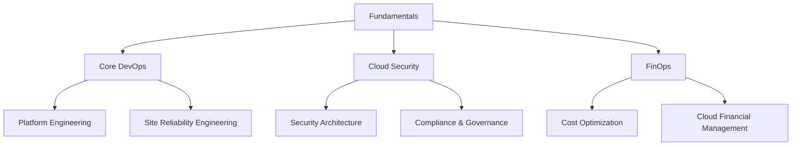

# 🛤️ Learning Paths

### 🎯 Choose Your Specialization

### 📊 Skill Level Progression

| Level | Duration | Focus | Projects |
|-------|----------|-------|----------|
| **Beginner** | 2-3 months | Fundamentals, Basic Tools | 3-5 small projects |
| **Intermediate** | 3-4 months | Specialization, Advanced Tools | 5-8 medium projects |
| **Advanced** | 4-6 months | Architecture, Leadership | 3-5 complex projects |
